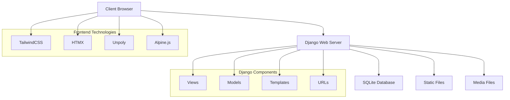
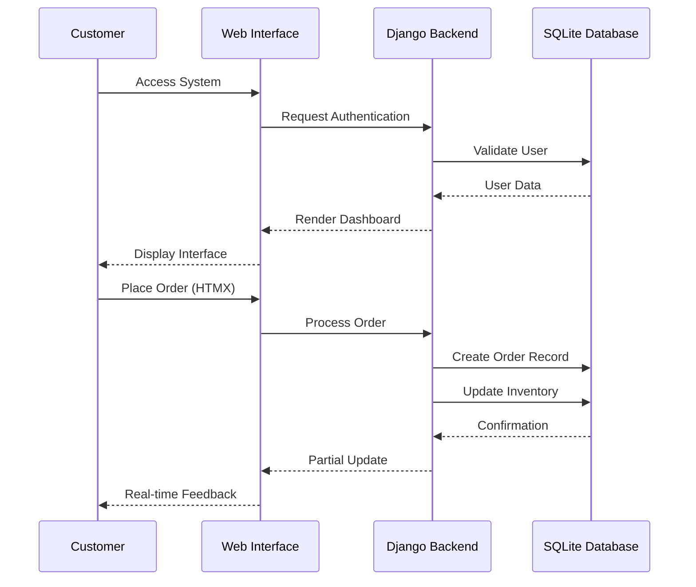
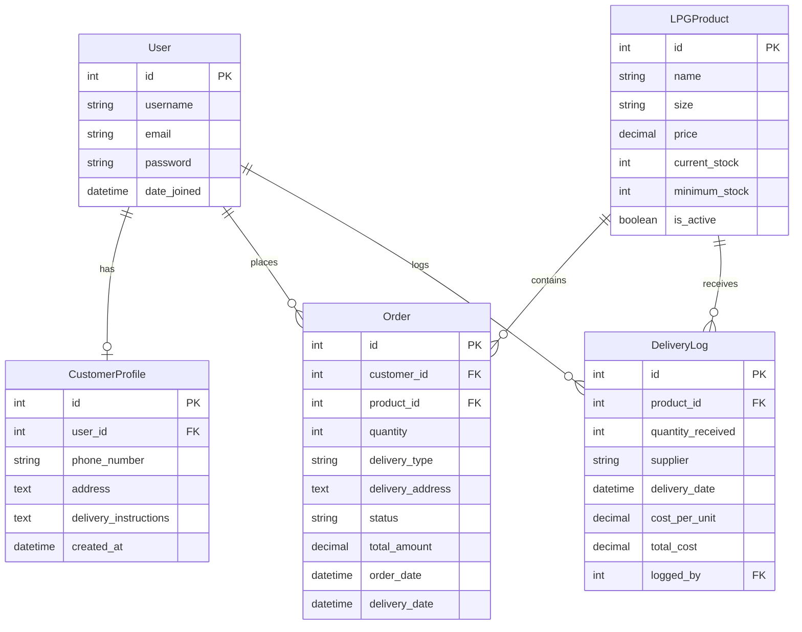

# Design Document

## Overview

The Web-Based Prycegas Dealer and Distributor Information System is a Django-based web application that modernizes LPG order management for Vios Prycegas Tambulig Station. The system uses a progressive enhancement approach with HTMX, Unpoly, and Alpine.js for dynamic interactions while maintaining server-side rendering for optimal performance in rural areas with limited connectivity.

The design follows a mobile-first responsive approach using TailwindCSS with a black and orange color scheme, ensuring usability across devices from low-end smartphones to desktop computers.

## Architecture

### System Architecture



### Application Flow



## Components and Interfaces

### Django Models

#### User Profile Extension
```python
class CustomerProfile(models.Model):
    user = models.OneToOneField(User, on_delete=models.CASCADE)
    phone_number = models.CharField(max_length=15)
    address = models.TextField()
    delivery_instructions = models.TextField(blank=True)
    created_at = models.DateTimeField(auto_now_add=True)
    updated_at = models.DateTimeField(auto_now=True)
```

#### Product Management
```python
class LPGProduct(models.Model):
    name = models.CharField(max_length=100)
    size = models.CharField(max_length=50)  # e.g., "11kg", "22kg"
    price = models.DecimalField(max_digits=10, decimal_places=2)
    current_stock = models.IntegerField(default=0)
    minimum_stock = models.IntegerField(default=10)
    is_active = models.BooleanField(default=True)
    created_at = models.DateTimeField(auto_now_add=True)
```

#### Order Management
```python
class Order(models.Model):
    STATUS_CHOICES = [
        ('pending', 'Pending'),
        ('out_for_delivery', 'Out for Delivery'),
        ('delivered', 'Delivered'),
        ('cancelled', 'Cancelled'),
    ]
    
    DELIVERY_CHOICES = [
        ('pickup', 'Pickup'),
        ('delivery', 'Delivery'),
    ]
    
    customer = models.ForeignKey(User, on_delete=models.CASCADE)
    product = models.ForeignKey(LPGProduct, on_delete=models.CASCADE)
    quantity = models.IntegerField()
    delivery_type = models.CharField(max_length=20, choices=DELIVERY_CHOICES)
    delivery_address = models.TextField()
    status = models.CharField(max_length=20, choices=STATUS_CHOICES, default='pending')
    total_amount = models.DecimalField(max_digits=10, decimal_places=2)
    order_date = models.DateTimeField(auto_now_add=True)
    delivery_date = models.DateTimeField(null=True, blank=True)
    notes = models.TextField(blank=True)
```

#### Inventory Management
```python
class DeliveryLog(models.Model):
    product = models.ForeignKey(LPGProduct, on_delete=models.CASCADE)
    quantity_received = models.IntegerField()
    supplier = models.CharField(max_length=100)
    delivery_date = models.DateTimeField()
    cost_per_unit = models.DecimalField(max_digits=10, decimal_places=2)
    total_cost = models.DecimalField(max_digits=10, decimal_places=2)
    logged_by = models.ForeignKey(User, on_delete=models.CASCADE)
    created_at = models.DateTimeField(auto_now_add=True)
```

### View Architecture

#### Customer Views
- **CustomerDashboardView**: Display order history and status
- **OrderCreateView**: Handle order placement with HTMX validation
- **OrderDetailView**: Show individual order details with real-time updates

#### Dealer/Admin Views
- **DealerDashboardView**: Main dashboard with inventory and order overview
- **OrderManagementView**: List and manage all customer orders
- **InventoryManagementView**: Display stock levels and manage inventory
- **DeliveryLogView**: Log new deliveries and update stock
- **ReportView**: Generate sales and inventory reports

### Template Structure

```
templates/
├── base.html                 # Base template with TailwindCSS and Alpine.js
├── components/
│   ├── sidebar.html         # Collapsible sidebar component
│   ├── notifications.html   # Toast notification component
│   └── modals.html         # Reusable modal components
├── customer/
│   ├── dashboard.html       # Customer dashboard
│   ├── order_form.html      # Order placement form
│   └── order_history.html   # Order history with HTMX updates
├── dealer/
│   ├── dashboard.html       # Dealer main dashboard
│   ├── orders.html         # Order management interface
│   ├── inventory.html      # Inventory management
│   └── reports.html        # Report generation
└── auth/
    ├── login.html          # Login form
    └── register.html       # Customer registration
```

## Data Models

### Entity Relationship Diagram



### Data Flow

1. **Order Placement**: Customer selects product → System checks inventory → Creates order → Updates reserved stock
2. **Order Processing**: Dealer updates status → System sends notifications → Updates customer view via HTMX
3. **Inventory Management**: Dealer logs delivery → System updates stock levels → Triggers low stock alerts if needed
4. **Reporting**: System aggregates order and inventory data → Generates HTML reports → Displays with filtering options

## Error Handling

### Client-Side Error Handling
- **Form Validation**: Alpine.js provides immediate feedback for invalid inputs
- **HTMX Errors**: Display user-friendly messages for network or server errors
- **Toast Notifications**: Auto-dismissing alerts for both success and error states

### Server-Side Error Handling
- **Model Validation**: Django model validation with custom error messages
- **View-Level Validation**: Additional business logic validation in views
- **Database Constraints**: Prevent data integrity issues with proper constraints
- **Inventory Validation**: Prevent overselling with stock level checks

### Error Response Strategy
```python
# Example error handling in views
def create_order(request):
    try:
        # Order creation logic
        if product.current_stock < quantity:
            return JsonResponse({
                'error': 'Insufficient stock available',
                'available': product.current_stock
            }, status=400)
    except ValidationError as e:
        return JsonResponse({'error': str(e)}, status=400)
    except Exception as e:
        logger.error(f"Order creation failed: {e}")
        return JsonResponse({
            'error': 'An unexpected error occurred. Please try again.'
        }, status=500)
```

## Testing Strategy

### Unit Testing
- **Model Tests**: Validate model methods, constraints, and relationships
- **View Tests**: Test view logic, permissions, and response formats
- **Form Tests**: Validate form processing and validation logic
- **Utility Tests**: Test helper functions and custom utilities

### Integration Testing
- **HTMX Integration**: Test partial page updates and form submissions
- **Authentication Flow**: Test login, registration, and permission checks
- **Order Workflow**: Test complete order lifecycle from placement to delivery
- **Inventory Updates**: Test stock level changes and delivery logging

### Frontend Testing
- **Alpine.js Components**: Test modal functionality and form interactions
- **Responsive Design**: Test layout across different screen sizes
- **Accessibility**: Ensure keyboard navigation and screen reader compatibility
- **Performance**: Test page load times and HTMX update speeds

### Test Data Strategy
- **Fixtures**: Create realistic test data for products, users, and orders
- **Factory Pattern**: Use factory classes for generating test objects
- **Database Isolation**: Ensure tests don't interfere with each other
- **Mock External Services**: Mock any external dependencies or APIs

### Testing Tools and Framework
```python
# Example test structure
class OrderModelTest(TestCase):
    def setUp(self):
        self.user = User.objects.create_user('testuser', 'test@example.com', 'password')
        self.product = LPGProduct.objects.create(name='11kg LPG', price=500.00, current_stock=50)
    
    def test_order_creation_reduces_stock(self):
        initial_stock = self.product.current_stock
        order = Order.objects.create(
            customer=self.user,
            product=self.product,
            quantity=5,
            delivery_type='delivery'
        )
        self.product.refresh_from_db()
        self.assertEqual(self.product.current_stock, initial_stock - 5)
```

### Performance Testing
- **Load Testing**: Simulate multiple concurrent users placing orders
- **Database Query Optimization**: Monitor and optimize N+1 queries
- **Static Asset Loading**: Test TailwindCSS and JavaScript loading times
- **Mobile Performance**: Test on low-end devices and slow connections

This design provides a solid foundation for implementing the LPG dealer system with modern web technologies while maintaining simplicity and performance for rural connectivity conditions.